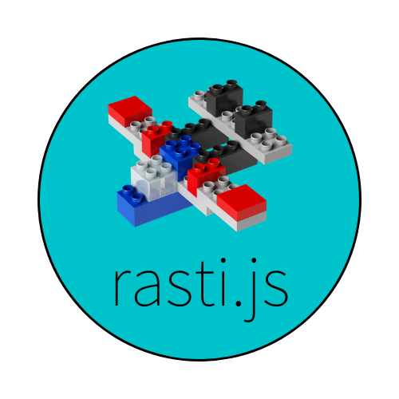

# Rasti.js



Rasti.js is a tiny frontend framework for building web prototypes in a fast and simple way. It was born from the process of building a prototype with the desire of being able to write just the essential, while also making the markup as expressive as possible. This led to a declarative attribute-driven html API backed by namespaces and a thin js API consisting of just  6 methods and a couple of objects.

# ❓ Why another framework? (for the love of Thor!)

The main motivation behind Rasti.js is `conciseness`, with `flexibility` in a second place. This means that its main goal is to be `brief` yet `expressive`, which is another way of saying `simple` but `powerful`. The basics can be learned in 10 minutes, the whole framework in less than an hour.

It is well suited for prototypes and small apps or demos and can be used as a stepping stone for jr devs before diving into more sophisticated frameworks like Vue or Angular (or React, though it is not a framework by itself and it deviates more in terms of cognitive load).

# 🧰 What's included? (and what's not)

Rasti.js is lightweight (40 KB minified, 30 KB gzipped) yet it includes all the features needed for making a nice Single Page App:

- Navigation / Routing
- Templating
- State management
- Reactivity
- Components (called "blocks") (WIP)
- Responsiveness
- i18n / l10n
- a11y (WIP)
- Icons (700+)

That said, it is not concerned (at least for the time being) with other (contextually crucial) things such as:
- Security
- Performance

Just to be clear on that:

**`*** DO NOT USE THIS FRAMEWORK FOR SENSITIVE STUFF. ALL YOUR DATA ARE BELONG TO US. YOU HAVE BEEN WARNED. ***`**

Got it? Great! Moving on.


# 🎮 Try it out!

Want to take rasti up for a spin? See if it suits you?  
Do you learn by fiddling rather than reading boring stuff? (hey! ಠ_ಠ)

If so, you can try it out [right now](https://codepen.io/kareraisu/pen/WNQqEgq?editors=1010), no config needed, no strings attached.

You can also check out [the demos](https://rasti-demo.herokuapp.com/) to get a sense of what you can do with it.

Interested? Awesome, read on!


# 🚀 Getting started

## Adding rasti.js and declaring your app

### The straight-forward way

The easiest way to get started with rasti.js is to add the CDN-hosted bundle to your html at the end of the `<head>` tag and declare your app in the `<body>` start tag with the `[rasti]` attribute, like so:

```html
<!DOCTYPE html>
<html>
<head>
    <!-- head stuff -->
    <script src=https://unpkg.com/@kareraisu/rasti></script>
</head>
<body rasti=coolApp>
    <!-- cool app here -->
</body>
</html>

```

The `[rasti=coolApp]` declaration does 3 things:
1. Creates a rasti instance named `coolApp`
2. Binds it to the container
3. Creates a `coolApp` global var to access the instance ( `window.coolApp = instance` )


*Note: You can declare your app in any container element you wish, such as a `<div>`. The `<body>` just happens to be the most usual candidate.*

Of course you may also download the bundle to your local file system and load it from there. Just make sure to publish the bundle along with the rest of your app if you do.

### The npm way

Alternatively, you can install it as dependency of your project via npm (you must have [Node.js](https://nodejs.org) installed):

```
$ npm i @kareraisu/rasti
```

This will clone this whole repo to your `node_modules` folder and add an entry for it in the `dependencies` section of your `package.json` manifest file. The rasti.js bundles will be in `node_modules/kareraisu/rasti/dist`.


## Adding some pages

An app is made of one or more "screens" or "views". In rasti these are called "pages", since that is the common term used in the web (because a web site is a document).
To add a page to your app simply create a `<div>` inside your app container with a `[page]` attribute with some meaningful name.

```html
<body rasti=cool_app>
    
    <div page=main>
        <h1>This is the main page</h1>
        <!-- main page content -->
    </div>

    <div page=about>
        <h1>About this cool app</h1>
        <!-- cool trivia -->
    </div>

</body>
```

## Navigating between pages

For the user to be able to navigate to another page, simply add an element with a `[nav]` attribute with the name of the target page.

```html
<body rasti=cool_app>
    
    <div page=main>
        <h1>This is the main page</h1>
        <!-- could be like this -->
        <button nav=about>About</button>
        <!-- or this -->
        <a nav=about>About</a>
        <!-- or this -->
        <span nav=about>About</span>
    </div>

    <div page=about>
        <h1>About this app</h1>
    </div>

</body>
```


## Initializing the app

Finally, to get your app running, just call `config()` with your app configuration and then `init()` with any init options you want. Note that these methods are chainable. 

```javascript

const config = {
    pages: {...},
    data: {...},
    methods: {...},
    themes: {...},
    langs: {...},
}

const options = {...}

cool_app
    .config(config)
    .init(options)

```

And that's it!  
Although there is one more thing worth mentioning...

## Keeping it clean
Of course that was just a tiny example. As you build your app, your config will grow and you may want to add some custom styles.  
When that happens, it makes sense to split up your code and have the logic and the styles in separate files. You then would link to these files in your html using `<script>` and `<link>` elements.  
You could do that... or you could let rasti do it for you by simply adding a `[src]` attribute to your app container with a comma-separated list of all the sources your app needs.

```html
<body rasti=coolApp src="cool.css, cool.js, ...">
```

The sources will then be loaded in the specified order and your html will be a bit cleaner.


# 📖 Documentation

The previous section was just to get your feet wet.

Check out [the docs](DOCS.md) for a full description of all the things rasti has to offer.

You can also peek into the [demos sources](https://github.com/kareraisu/rasti-demo/tree/master/demos) to get some insights.


# 🍻 Contributing

We are always happy to hear from you!

Let us know of any bugs you find, improvements you think of or features you would like by [creating an issue](https://github.com/kareraisu/rasti.js/issues) (check first if your concern is already addressed).

You can also help by fixing existing issues or implementing improvements or new features yourself! Head over to [Contributing](CONTRIBUTING.md) for more details.


# 🗺️ Roadmap

These are some of the things that are coming:

- [ ] Refactor blocks into actual (web standard) custom elements
- [ ] Improve theming with css variables
- [ ] Easy toasts
- [ ] Easy keyboard bindings (per page and global)
- [ ] More fx's (fade, slide, flip, twist)

<details>
  <summary>Things already done</summary>

- [x] Templates
- [x] State management and persistence
- [x] Themes api
- [x] Blocks api
- [x] Page hooks
- [x] Url navigation
- [x] Function data sources
- [x] i18n support
- [x] Internal (instance) history
- [x] Field validation (📝)
- [x] Field dependency (📝)
- [x] Paging
- [x] Sidenav (📝)
- [x] Tabs (📝)
- [x] Modals and menus
- [x] Icons  (📝)
- [x] Attribute fallback
- [x] App bootstrapping
- [x] Single bundle (js+css)
- [x] Base styles

(📝) : docs pending

</details>


# 🧱 About the name

[Rasti](https://en.wikipedia.org/wiki/Rasti) is a block construction toy made in [Argentina](https://www.google.com/search?q=argentina+landscape&tbm=isch) that resembles Lego, but it's much simpler. This framework was built with simplicity in mind, and includes some "blocks", so the name fits nicely.


# 🖋️ License

Rasti.js is [MIT licensed](LICENSE), which basically means you can do whatever you want with it, just as long as you keep a copy of the license alongside it 🤙
